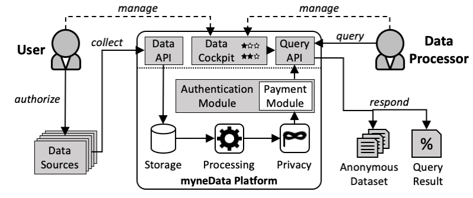
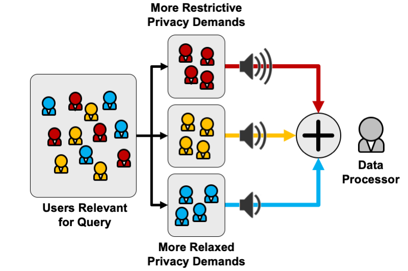

# myneData - A User-Centered Data Market - Demonstrator

**Warning: This is a research demonstrator. Use for studying and exploration pursoses only; especially, do not use code in production without further vetting.**

The business model of leading Internet companies is the collection and monetization of user data.
Meanwhile, this monetization of such sensitive data represents one of the most serious privacy threats.
Here, economic interests directly clash with demands and rights of individual users.
However, users often have no control whatsoever to protect their privacy, nor do they get a share of the profit gained from their data.

The goal of this project is the creation of a digital platform that enables its users to i) decide about the processing of their data themselves, while ii) tuning their privacy protection according to their own demands and, finally, iii) let them participate in the value creation based on their data.
This sub-project shall thus realize the technical foundation for a holistic solution if this aforementioned conflict between data processing and protecting personal data.
From a technical perspective, this approach opens up an entirely novel design space for (data) economics and judicature, in which the user constitutes an inherent stakeholder in the design process and is recognized as a coequal actor regarding the processing of their data.

#### Organization

This repository hosts the demonstrator developed in the context of the myneData project.
First, we provide an introduction to the demonstrator's core concepts and platform architecture.
If you then follow the instructions thereafter, you will create a local virtual machine using Vagrant and VirtualBox to host a private instance of the demonstrator.
Furthermore, we describe how to set up the demonstrator natively on a fresh Ubuntu installation.
Finally, we provide general technical information how to interact with the Vagrant VM in case of errors, but this mostly concerns developers.

#### Publications

In the publication below, we define the scenario and challenges for a digital data market that acknowledges individual privacy demands.
For a full list of publications related to myneData, please refer to the [COMSYS homepage](https://www.comsys.rwth-aachen.de/research/past-projects/mynedata).

* R. Matzutt, D. Müllmann, E.-M. Zeissig, C. Horst, K. Kasugai, S. Lidynia, S. Wieninger, J. H. Ziegeldorf, G. Gudergan, I. Spiecker gen. Döhmann, K. Wehrle. _myneData:_ Towards a Trusted and User-controlled Ecosystem for Sharing Personal data. Proc. INFORMATIK'17. URL: https://www.comsys.rwth-aachen.de/fileadmin/papers/2017/2017-matzutt-informatik-mynedata.pdf

#### Acknowledgements

This work has been funded by the German Federal Ministry of Education and Research (BMBF) under funding reference number 16KIS0443. 
The responsibility for the content of this publication lies with the authors.

#### Contact

In case of questions beyond the source code, you can contact us via Email at [mynedata@comsys.rwth-aachen.de](mailto:mynedata@comsys.rwth-aachen.de).

# Overview of myneData

Before getting into the technical details of setting up the demonstrator and running it, we provide a brief introduction to the core concepts utilized by the demonstrator to showcase a digital data market that takes users' individual privacy demands into account.

## High-Level Overview



The data market provided by myneData is a place where users and data processors come together.
Above, we illustrate the architecture of the myneData platform that manages this joint utilization of the data market.
Its main component is the data cockpit, where users manage their data sources and sensitivity profile and where they review and approve data processing requests.
Furthermore, data processors have a high-level overview of their pending and past data processing requests.
We realized the data cockpit as a webbased fronted that is built on top of a RESTful API, which exposes all functionality offered by the platform and thereby facilitates the creation of alternative frontends, e.g., for tailoring the user interface to more specific use cases.

The myneData platform performs data collection and processing in six steps.
First, users register their data sources and authorize them to push data onto the myneData platform on their behalf.
The platform offers a general-purpose data API to allow for recording data from highly diverse sources, with the potential to implement adapters for legacy data sources that are not myneData-compatible otherwise.
Subsequently, data processors query the pool of submitted user data via an SQL-like query language via the query API.
They can request anonymized datasets or statistical information such as the average activity level among local students.
Following the request is the query’s approval phase: Users who can provide valuable data for the query are asked to share this data with the data processor.
Each user can review the terms of the query, i.e., which data is requested by whom, the number of expected participants, how it will be processed, and how participating users are compensated.
The user can thus willingly accept or deny this request.
A dedicated authentication module with a payment submodule monitors that no data leaves the platform until the query’s terms are satisfied.
Once enough users decided to participate, the platform computes the result by processing the data and applying privacy-enhancing technologies such as _k_-anonymity or differential privacy to protect the users.
Finally, the platform responds to the data processor by notifying her and returning the obtained result in a standardized format such as a JSON-based object.

The main challenge for our platform is a policy how to resolve conflicts between user and data processor interests.
As a sufficiently sized user base is critical to an online platform’s success, we prioritize user concerns over data processor interests whenever conflicts arise.

## Core Concepts

Core components of mnyeData comprise a general-purpose framework to access diverse data sources, realizing tunable privacy based on users' individual privacy demands, and compensating users who share their data via micropayments.

### Accessing Data Sources

In myneData, we rely on a general-purpose and attribute-based data model to handle diverse data sources in a unified manner.
Data sources are described within the myneData platform as a set of legal attributes together with both their technical and logical types.
As expected, the technical type of an attribute specifies whether the attribute holds, e.g., floating point numbers or text strings, and thereby implies possible operations for queries over this attribute.
Contrarily, the logical type of an attribute specifies that attribute's semantics for the user, e.g., whether the attribute is related to location data, general sensor data, or personal information.
The myneData platform uses this distinction to implement a user's individual privacy demands: as users are more likely to have a clear demand regarding the information an attribute conveys rather than the attribute's technical type or mere name, a user's privacy demand regarding a logical type is mapped to an attribute's logical type whenever data of that attribute is being processed by a query.

All data from external data sources is uploaded via a RESTful data API, which uses a data format that is based on the [Sensor Measurements Lists (SenML, formerly Sensor Markup Language)](https://tools.ietf.org/html/rfc8428)
SenML allows data sources to be based on both, static and dynamic attribute sets.
Dynamic attribute sets are supported primarily due to the importance of processing sensor data, as this use case requires supporting almost arbitrary contexts due to the diversity of local configurations of sensor networks.
However, simply allowing full diversity limits the utility of query, as theoretically combinable attributes may have different names, or attributes may have too general names causing them to be unrelated for most queries.
For instance, a simple `temperature` attribute may refer to both an inside or outside smart thermometer.

All data sources use a push model, i.e., they have to actively make an API call to upload data.
However, not all data sources are this flexible, e.g., [Facebook's Graph API](https://developers.facebook.com/docs/graph-api) requires applications to pull data.
In this case, we propose to implement adapters that poll a data source's relevant attributes periodically and upload that data to the myneData platform.
To showcase a simple data source using this push model, we have implemented a simple demo Android application  that is available [upon request](#contact).

### Tunable Privacy

The main promise of the myneData project is to create a digital data market that acknowledges and respects its users' individual privacy demands.
We now outline how we approached this challenge.

In the context of myneData, we have considered multiple approaches, both established and novel, to protect users' privacy.
However, one main challenge in this regard was the fact that users must be able to determine their own privacy demands and then grasp the guarantees provided by the implemented privacy protection measures to make well-informed decisions.
Hence, simple and well-established privacy protection using noise addition, _k_-anonymity, or _&epsilon;_-differential privacy is beneficial as users can basically understand what they get here without involved knowledge of the mechanisms' inner workings.

#### Expressing User Privacy Demands

A core vision of myneData was the creation of a "privacy slider" allowing users to fine-granularly express their individual privacy demands.
Our colleagues at the [Chair of Communication Science](http://www.comm.rwth-aachen.de/index.php?clang=1) of RWTH Aachen University did a great job at [identifying users' needs and perception of privacy](http://www.comm.rwth-aachen.de/files/hiddenwithinagroupofpeople.pdf) and designed our demonstrator's privacy wizard.

However, users' privacy settings must properly transfer to implementing those settings.
All of our used privacy mechanisms, noise addition, _k_-anonymity, and _&epsilon;_-differential privacy, respectively, have one privacy parameter to tune, which nicely lends itself to be configured using a slider.
However, the semantics of the slider positions, i.e., the privacy levels offered, remains unclear.
To fill this gap, we defined anchor points for all privacy measures (e.g., relying on results from the Chair of Communication Science or proposals of related work) for low, medium and high levels of privacy protection.
For a more fine-granular control over desired privacy levels, we can further interpolate in-between privacy parameters using a scaling factor.

In theory, this approach enables the creation of a privacy slider with an arbitrary granularity of privacy levels.
However, considering that users without proficient knowledge of data privacy shall be able to operate the slider and considering a need for combinability of data protected with different privacy demands in mind, we decided to nevertheless limit the available options for privacy protection to "low", "medium", "high", and "don't share".

#### Combining Data With Varying Privacy Protection



Even though the selected privacy protection mechanisms allow for fine-granularly tuning privacy guarantees, _k_-anonymity and _&epsilon;_-differential privacy only feature one global privacy parameter.
They are thus not directly applicable when users shall be enabled to express their individual privacy demands.

Thus, we propose to limit offered privacy protection again to few, well-defined classes.
This approach allows the myneData platform to partition users providing their data for computation of a query according to their selected privacy classes as shown in the figure above.
Based on this partitioning, the results of sub-queries can be computed and privacy-protected using the privacy parameter corresponding to the respective user class.
Finally, the results of those sub-queries can be merged and constitute the final result given to the data processor.

### Digital Micropayments via Bitcoin

Users need an incentive to contribute their data to a data market such as myneData.
While altruistic motives may be sufficient for some, others demand monetary compensation.
Digital micropayments can satisfy this demand.
Beyond centralized financial services, such as PayPal or Google Pay, decentralized cryptocurrencies are becoming a new means for digital payments.

Although Bitcoin remains the most popular cryptocurrency (as tracked by [CoinMarketCap](https://coinmarketcap.com/)), and thus would be the best target for myneData's micropayments, limited transaction sizes and varying transaction fees render such micropayments unprofitable.
Aggravating this issue, known measures such as [micropayment channels](https://en.bitcoin.it/wiki/Payment_channels) are not applicable to digital data markets, as micropayment channels strongly focus of a constant stream of small-value transactions between two parties.
Contrarily, a digital data market requires infrequent _1_-to-_n_ micropayments, i.e., whenever a data processor pays out all participating users.

In myneData, we thus take an approach where micropayments are escrowed to the myneData platform.
This way, the platform operator can pay out users efficiently by buffering micropayments for individual users until the payout becomes economically feasible and merging the payouts of multiple users.
If users put lower trust into the platform operator to manage their micropayments than their data, the escrowed micropayments could additionally be secured, e.g., by using threshold cryptography, as is used by Bitcoin applications such as the tumbler [CoinParty](https://github.com/COMSYS/CoinParty).

Besides, cryptocurrencies have some further drawbacks than those directly related to the micropayment scheme.
For instance, the possibility to immutably insert unwanted or even illegal content into massively replicated blockchain systems may become a setback for a widespread acceptance of cryptocurrencies.
We have [thoroughly analyzed and tackled this problem](https://blockchain.comsys.rwth-aachen.de) in the context of myneData, but at the same time call for further research to make cryptocurrencies ready for prime time.

## Platform Overview

Our demonstrator uses state-of-the-art building blocks for showcasing how a digital data market can be realized.
In the following, we outline those technologies and their interplay in our demonstrator.

### Backend

Most backend functionality is implemented as part of the `lib` package of this repository.
At the core, our demonstrator relies on the distributed task queue [Celery](http://www.celeryproject.org) to offer an engine for fine-granularly processing tasks.
All core operations of the demonstrator are realized as tasks, which we briefly describe in the following:

* `lib.backend.tasks.data_source`: All tasks related to (instances of) data sources, e.g., uploading new data or managing a user's privacy settings regarding a particular data source.
* `lib.backend.tasks.payment`: All tasks related to Bitcoin-based micropayments, based on the helper module `lib.backend.payments`, which handles interfacing with a local Bitcoin client.
* `lib.backend.tasks.preprocessing`: Collection of query-independent processing tasks, e.g., aligning user data for further processing or applying privacy mechanisms.
* `lib.backend.tasks.user`: All tasks related to user management (end users as well as data processors).
* `lib.backend.tasks.query`: All tasks related to query management and execution.

Most tasks are generated through actions in the frontend.
Communication between the frontend and backend is performed via the AMQP protocol using [RabbitMQ](https://www.rabbitmq.com).
This way, myneData remains extensible to supporting alternative frontends, e.g., application-specific views.
However, some tasks, such as polling the local Bitcoin client for incoming payments, occur periodically.

Data management of our demonstrator uses [SQL Alchemy](https://www.sqlalchemy.org) as an abstraction from specific database implementations.
This way, the demonstrator may use, for instance, an SQLite database for testing and development purposes, but switch to a more scalable solution such as PostgreSQL for production.

#### Scalability

Our demonstrator is built with scalability in mind.
Specifically, the demonstrator is easily adaptable to implement a microservice-based architecture.
During the course of the myneData project, we also developed a proof-of-concept implementation of the platform that fully seizes the scalability opportunities offered by our chosen architecture.
This implementation is based on [Kubernetes](https://kubernetes.io), an open-source system for automating deployment, scaling, and management of container-based applications.
Kubernetes integrates well with our task-based architecture relying on RabbitMQ and Celery, and thus only some of our modules need slight adaption to fully seize the scaling potential offered by a microservice-based architecture.
For instance, our standard demonstrator did not flag queries that are currently being processed, potentially leading to the redundant execution of queries.

Actually performing automated out-scaling of our platform components is achieved through a combination of different open-source solutions.
The Kubernetes cluster uses [Keda](https://github.com/kedacore/keda) to monitor the number of tasks queued via RabbitMQ.
Further, we use [Prometheus](https://github.com/coreos/kube-prometheus) to monitor system metrics such as CPU 
usage and instruct Keda to add or remove instances dynamically based on this data.
Finally, we use [Traefik](https://containo.us/traefik) as a load balancer to manage varying patterns of frontend utilization.

In conclusion, our microservice architecture enables the platform operator to specify high-level policies, e.g., "don't exceed a CPU usage of 70% per core", which are dynamically implemented by the architecture.

This code is not part of this repository to keep the other core contributions more accessible to developers.
However, if you are interested in our microservice architecture, [contact us](#contact)!

#### Documentation

See [doc/backend](doc/backend).

### APIs

Our demonstrator offers a RESTful API for users, data processors, and data sources to use.
All functionality of the demonstrator is exposed via the API to keep frontends slim.
We implemented the API using the Python library [Connexion](https://github.com/zalando/connexion), which uses [Flask](https://palletsprojects.com/p/flask) to create endpoints for APIs specified via [OpenAPI](https://swagger.io/docs/specification/about) (formerly Swagger).
Each API endpoint creates Celery tasks and hands them over to the backend using RabbitMQ for further processing.

#### Query Language

Data processors can use an intuitive SQL-like query language to specify the insights they want to gain from data residing on the myneData platform, e.g., `SELECT AVG(RandomData.random_two) WHERE (PersonalInformation.city = aachen) OR (PersonalInformation.city = bochum)`.
The demonstrator implements simple functions such as `AVG` or `SUM`, but remains extensible to new functions, supporting single and multiple arguments of the form `Datasource.attribute`.
Query selectors (`WHERE ...`) are implemented in disjunctive normal form where the left side of each `OR` and each `AND` is a single constraint of the form `Datasource.attribute [<,>,=] String/Number`, where `[<,>]` is only valid for numbers. 
Hence, for example `... WHERE (A.a = b) OR ((B.b = b) OR (C.c = c))` is valid while `... WHERE ((A.a = b) OR (B.b = b)) OR (C.c = c))` is not.

#### Documentation

See [doc/api](doc/api).

### Web-Based Frontend

We implemented a web-based frontend, our data cockpit, in cooperation with the Chair of Communication Science of RWTH Aachen University.
For this, we use the [Angular](https://angular.io) framework, which supports both desktop and mobile views natively.
The frontend heavily utilizes the API endpoints offered by the platform so that it mostly remains one of many thinkable views.

# Demonstrator Utilization

We now provide basic instructions on how to initialize and operate the demonstrator, both using a virtual machine via the provided `Vagrantfile` and relying on a native setup assuming a fresh Ubuntu installation.

## Virtual Machine via Vagrant

### Set Up Vagrant

1. [Download VirtualBox](https://www.virtualbox.org/wiki/Downloads)
    * If you already installed VirtualBox, make sure that you perform an update!
2. [Download VirtualBox Extensions](https://www.virtualbox.org/wiki/Downloads) (click on the Extensions link and install the Extension pack)
    * to install the extension start VirtualBox as admin/root and go to `File -> Settings -> Extensions`
3. [Download Vagrant](https://www.vagrantup.com/downloads.html)

### Set Up myneData Demonstrator

To run the demonstrator, go inside the `vagrant` folder and run the `boot_demonstrator.sh` script:

```
cd vagrant
bash boot_demonstrator.sh
```

Vagrant will ask you to for a network device to use for Internet connectivity (to install needed software):

```
==> mynedata_platform: Available bridged network interfaces:
1) en1: Apple USB Ethernet Adapter
2) en0: Wi-Fi (AirPort)
3) p2p0
4) awdl0
5) en3: Thunderbolt 1
==> mynedata_platform: When choosing an interface, it is usually the one that is
==> mynedata_platform: being used to connect to the internet.
    mynedata_platform: Which interface should the network bridge to? 1
```

If you are working from an Apple device, you probably have similar network devices available as displayed above.
In this case, choose `Apple USB Ethernet Adapter` if you are currently connected to the Internet via an Ethernet cable or `Wi-Fi (AirPort)` if you are currently using Wifi.
For other systems, the available interfaces will differ (which makes this part hard to automate, sorry!).

The command will take a long time to install needed software inside the Vagrant machine and to build the UI, you can easily grab a coffee now.
Once it is finished, the myneData components will be started automatically inside the Vagrant machine.
From this point on, you can access the myneData UI via your browser at address `http://localhost:14201`.
The myneData API can be reached via `http://localhost:14201/api/v2`, respectively.

:information_source: Chrome is reported to display the frontend properly, Firefox has some issues.

### Demonstrator Technical Troubleshooting

:information_source: If the Application gets built and can be reached via `localhost:14201` but links do not work or the app behaves weirdly otherwise, you should run `sudo rm -rf /opt/mynedata/` from inside the vagrant VM. After that, exit the VM and run the `boot_demonstrator.sh` script anew.

:information_source: If the app doesn't even get built, log into vagrant via `vagrant ssh` and execute `sudo bash /mynedata/dev/setup_mynedata_environment.sh`.

### Low-Level Usage of the Vagrant Virtual Machine

For running the myneData demonstrator it should not be required to interact directly with the virtual machine apart from shutting it down or destroying it.
The script `boot_demonstrator.sh` should be sufficient to set everything up.
However, in case something breaks or you want to explore the demonstrator more closely, the following commands may be helpful.

:information_source: Vagrant expects all commands to be run from the folder containing the `Vagrantfile`, hence use `cd vagrant` before proceeding.

* Start virtual machine: `vagrant up`
    * The repository's main folder is automatically mounted to `/mynedata`.
    * Files created by myneData are stored at `/opt/mynedata`.

* SSH access: `vagrant ssh`
    * Execute a single command with `vagrant ssh -c "${your_command}"`.

* Shutdown virtual machine: `vagrant halt [-f]`
    * The flag `-f` forces shutdown, sometimes graceful shutdown may not work 

* Delete virtual machine: `vagrant destroy [-f]`

## Native Setup

:information_source: We assume that you install everything on a **fresh** machine.
Our setup will potentially change system-wide configuration (but create backups of replaced config files - hopefully).

:information_source: The scripts are only written to work with Ubuntu-like systems.

Everything should be installed automatically when running:

```
sudo bash dev/setup_mynedata_environment.sh
```

Afterwards, you can start all services via:

```
bash mynedata_all.sh start
```

# Documentation

To build the documentation, see [doc/README.md](doc/README.md)
